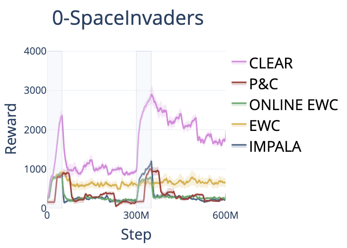
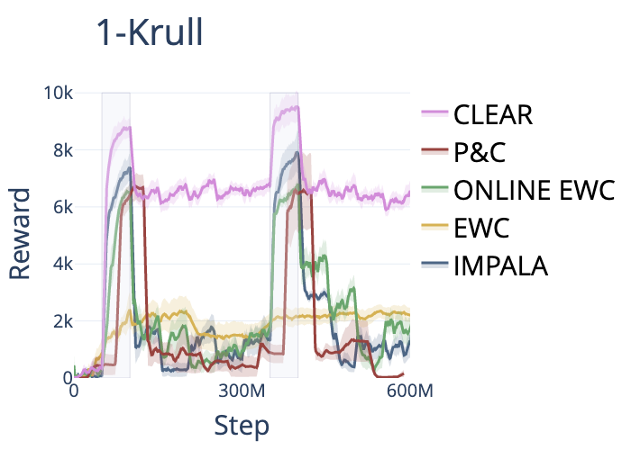
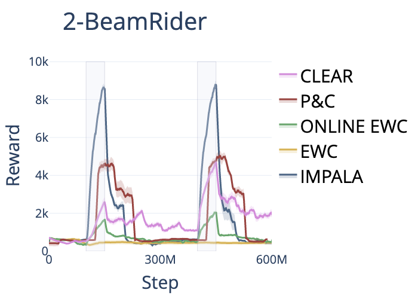
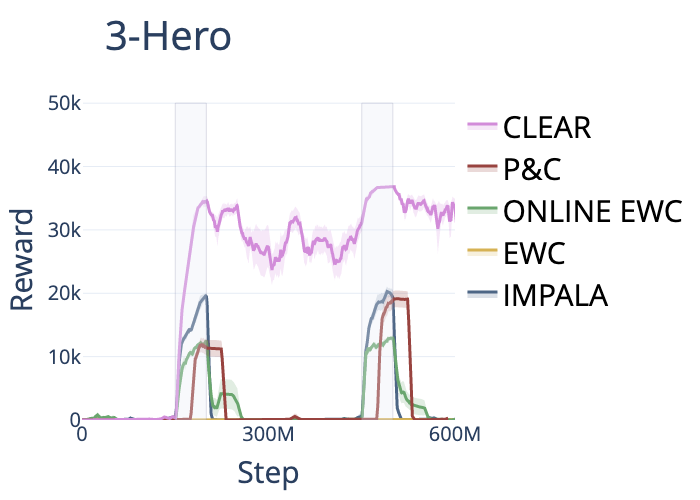
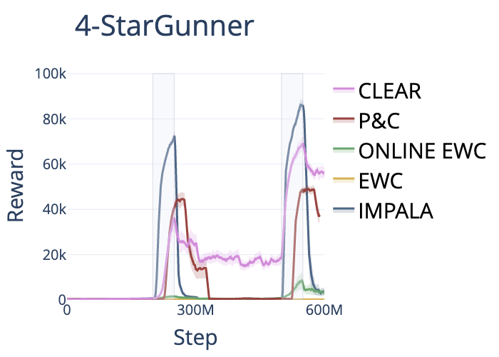
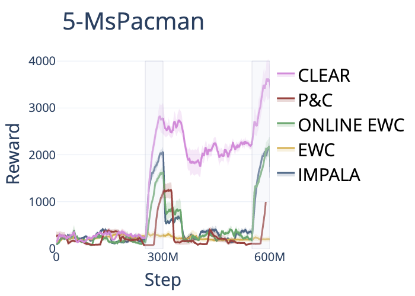

# Atari Benchmark Results for Continual RL

## Overview
- Results are generated by running algorithms on experiment `atari_6_tasks_5_cycles` that trains a sequence of 6 Atari tasks [0-SpaceInvaders, 1-Krull, 2-Beamrider, 3-Hero, 4-StarGunner, 5-MsPacman] of 50M frames each for 5 learning cycles, so each cycle takes 300M frames. This is the same Atari experiment reported in [3, 4]. 
- Due to compute constraints, we report 5 seeds of each algorithm for only the first 2 learning cycles, or 600M total frames.
For us, each run took between 4 to 10 days uninterrupteds on a 32 thread machine with an NVIDIA TITAN X Pascal or 1080 Ti; our runs were usually CPU-bottlenecked.
- We benchmark EWC [1], online EWC [2], P&C [2], and CLEAR [3], and also report a baseline result using IMPALA [4] which the listed methods are based on.
- IMPALA implementation is based on `monobeast.py` from commit [`3f3029`](https://github.com/facebookresearch/torchbeast/tree/3f3029cf3d6d488b8b8f952964795f451a49048f) of TorchBeast [5].

## Results on Atari

- IMPALA implementation from TorchBeast outperforms the earlier, pre-release version of IMPALA used [2, 3].
- Our EWC performance stays around the same as training continues, which is consistent with the reported results.
- Our online EWC exhibits more catastrophic forgetting than is shown in [2], this may require more investigation.
- Our P\&C also exhibits more catastrophic forgetting than is shown in [3], as P\&C uses online EWC during the compress phase. 
- For P\&C, we trained the progress phase for the first 25M steps and the compress phase for the last 25M steps of each task. The original P\&C results reported in [2, 3] used twice the number of frames, training each stage for 50M frames each task which results in a total of 100M frames used per task per cycle. This may also impact our P\&C results and be causing more forgetting.
- CLEAR exhibits less catastrophic forgetting than all other algorithms, and at times learns tasks better than the base IMPALA agent, such as in 0-SpaceInvaders, 1-Krull, 3-Hero, and 5-MsPacman. This indicates that IMPALA with a replay buffer (which CLEAR basically is) is a better learning agent than base IMPALA. 
- For CLEAR, we used a 25M frame replay buffer while the original CLEAR paper used a replay buffer of half the number of frames that the agent trains on. For two cycles, this would correspond to 300M frames, while the authors of CLEAR used a replay buffer of 750M frames for their Atari experiment running 5 learning cycles. Due to system constraints, we are unable to run with the larger replay buffer size. 


|   |   |   |
|---|---|---|
 |  | 
 |  | 
|   |   |   |

## References
[1] 
```
@article{kirkpatrick2017ewc,
  title={Overcoming Catastrophic Forgetting in Neural Networks},
  author={Kirkpatrick, James and Pascanu, Razvan and Rabinowitz, Neil and Veness, Joel and Desjardins, Guillaume and Rusu, Andrei A and Milan, Kieran and Quan, John and Ramalho, Tiago and Grabska-Barwinska, Agnieszka and others},
  journal={Proceedings of the National Academy of Sciences of the United States of America},
  volume={114},
  number={13},
  pages={3521--3526},
  year={2017}
}
```

[2]
```
@inproceedings{schwarz2018progress,
  title={Progress \& Compress: A scalable framework for continual learning},
  author={Schwarz, Jonathan and Czarnecki, Wojciech and Luketina, Jelena and Grabska-Barwinska, Agnieszka and Teh, Yee Whye and Pascanu, Razvan and Hadsell, Raia},
  booktitle={International Conference on Machine Learning},
  pages={4528--4537},
  year={2018}
}
```

[3]
```
@inproceedings{rolnick2018clear,
    author = {Rolnick, David and Ahuja, Arun and Schwarz, Jonathan and Lillicrap, Timothy and Wayne, Gregory},
    booktitle = {Advances in Neural Information Processing Systems},
    editor = {H. Wallach and H. Larochelle and A. Beygelzimer and F. d\textquotesingle Alch\'{e}-Buc and E. Fox and R. Garnett},
    pages = {350--360},
    publisher = {Curran Associates, Inc.},
    title = {Experience Replay for Continual Learning},
    url = {https://proceedings.neurips.cc/paper/2019/file/fa7cdfad1a5aaf8370ebeda47a1ff1c3-Paper.pdf},
    volume = {32},
    year = {2019}
}
```

[4]
```
@inproceedings{espeholt2018impala,
  title={Impala: Scalable distributed deep-rl with importance weighted actor-learner architectures},
  author={Espeholt, Lasse and Soyer, Hubert and Munos, Remi and Simonyan, Karen and Mnih, Vlad and Ward, Tom and Doron, Yotam and Firoiu, Vlad and Harley, Tim and Dunning, Iain and others},
  booktitle={International Conference on Machine Learning},
  pages={1407--1416},
  year={2018},
  organization={PMLR}
}
```

[5]
```
@article{torchbeast2019,
  title={{TorchBeast: A PyTorch Platform for Distributed RL}},
  author={Heinrich K\"{u}ttler and Nantas Nardelli and Thibaut Lavril and Marco Selvatici and Viswanath Sivakumar and Tim Rockt\"{a}schel and Edward Grefenstette},
  year={2019},
  journal={arXiv preprint arXiv:1910.03552},
  url={https://github.com/facebookresearch/torchbeast},
}
```
