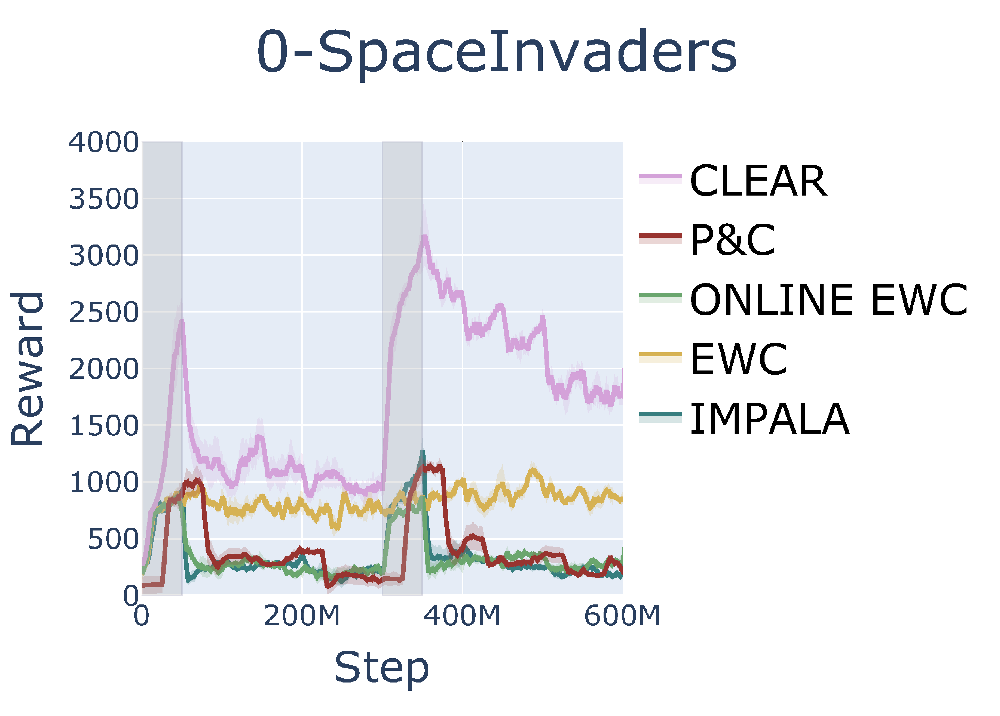
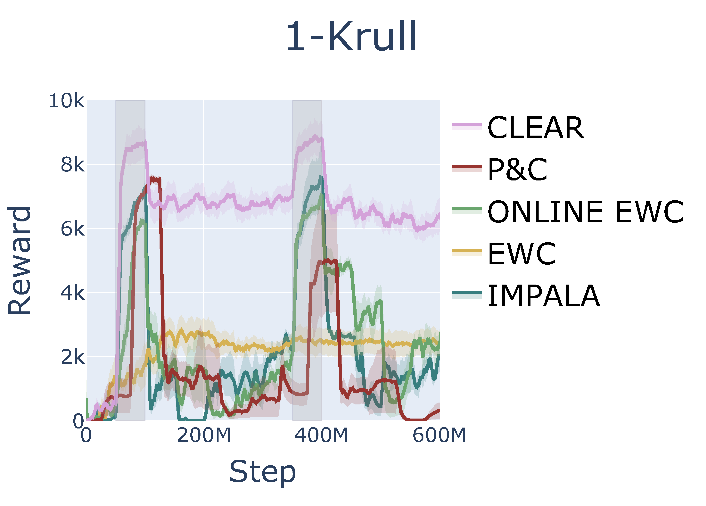
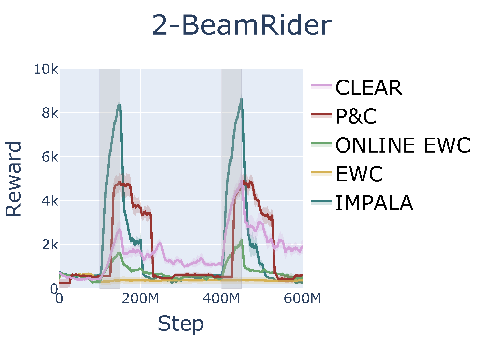
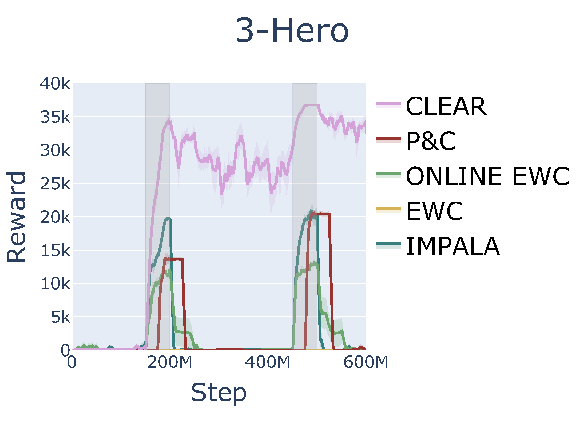
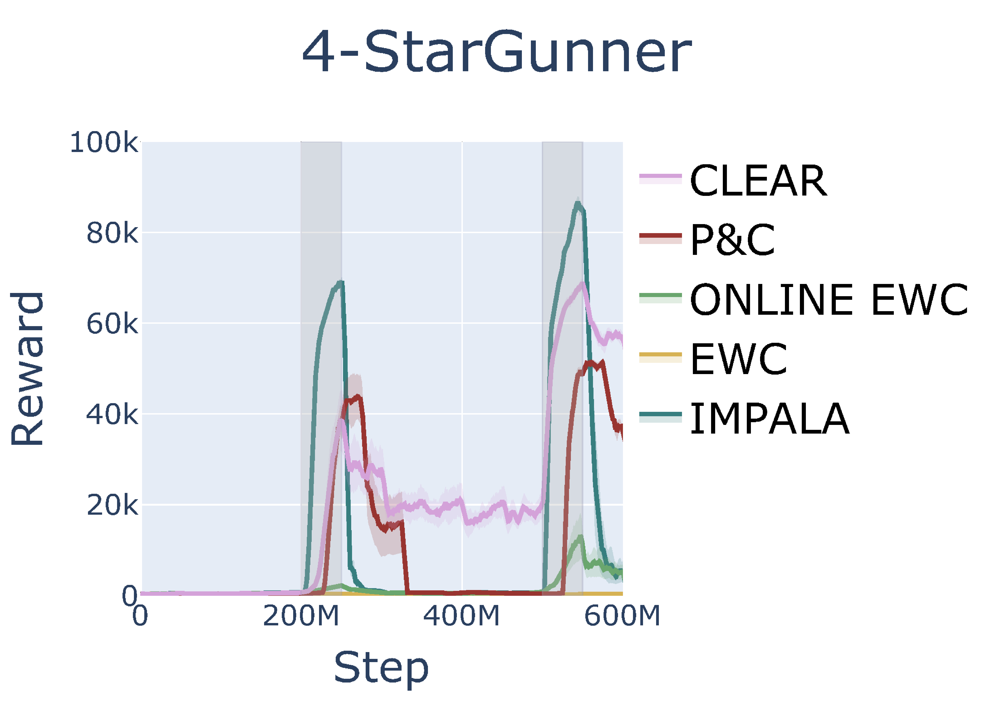
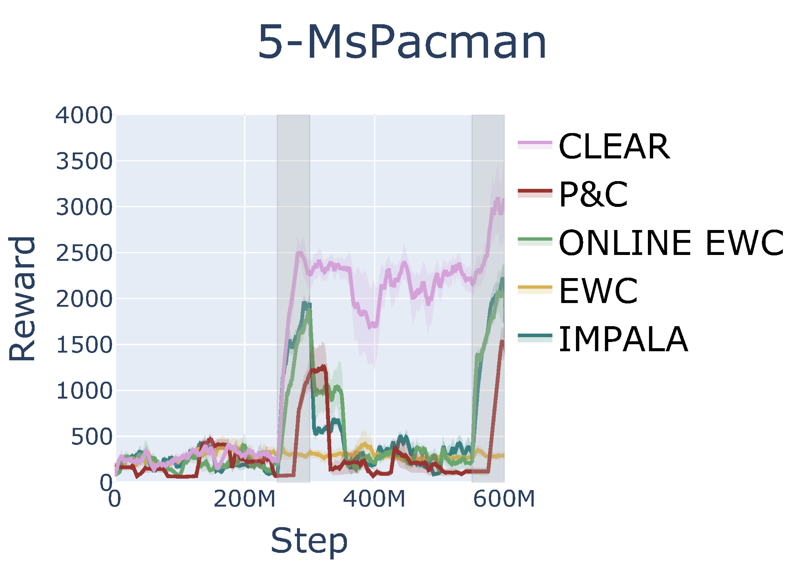

# Atari Benchmark Results for Continual RL

## Overview
- Results are generated by running algorithms on experiment `atari_6_tasks_5_cycles` that trains a sequence of 6 Atari tasks [0-SpaceInvaders, 1-Krull, 2-Beamrider, 3-Hero, 4-StarGunner, 5-MsPacman] of 50M frames each for 5 learning cycles, so each cycle takes 300M frames. This is the same Atari experiment reported in [3, 4]. 
- Due to compute constraints, we report 5 seeds of each algorithm for only the first 2 learning cycles, or 600M total frames. 
- We benchmark EWC [1], online EWC [2], P&C [2], and CLEAR [3], and also report a baseline result using IMPALA [4] which the listed methods are based on.
- IMPALA implementation is based on `monobeast.py` from commit [`3f3029`](https://github.com/facebookresearch/torchbeast/tree/3f3029cf3d6d488b8b8f952964795f451a49048f) of TorchBeast [5].
- (07/26/21) We are still missing one seed for P\&C and CLEAR, so only 4 seeds are reported for these two methods.

## Results on Atari

- IMPALA implementation from TorchBeast outperforms the earlier, pre-release version of IMPALA used [2, 3].
- Our EWC performance stays around the same as training continues, which is consistent with the reported results.
- Our online EWC exhibits more catastrophic forgetting than is shown in [2], this may require more investigation.
- Our P\&C also exhibits more catastrophic forgetting than is shown in [3], as P\&C uses online EWC during the compress phase. 
- For P\&C, we trained the progress phase for the first 25M steps and the compress phase for the last 25M steps of each task. The original P\&C results reported in [2, 3] used twice the number of frames, training each stage for 50M frames each task which results in a total of 100M frames used per task per cycle. This may also impact our P\&C results and be causing more forgetting.
- CLEAR exhibits less catastrophic forgetting than all other algorithms, and at times learns tasks better than the base IMPALA agent, such as in 0-SpaceInvaders, 1-Krull, 3-Hero, and 5-MsPacman. This indicates that IMPALA with a replay buffer (which CLEAR basically is) is a better learning agent than base IMPALA. 
- For CLEAR, we used a 25M frame replay buffer while the original CLEAR paper used a replay buffer of half the number of frames that the agent trains on. For two cycles, this would correspond to 300M frames, while the authors of CLEAR used a replay buffer of 750M frames for their Atari experiment running 5 learning cycles. 


|   |   |   |
|---|---|---|
 |  | 
 |  | 
|   |   |   |

## References
[1] 
```
ewc
```

[2]
```
p\&c
```

[3]
```
clear
```

[4]
```
impala
```

[5]
```
torchbeast
```